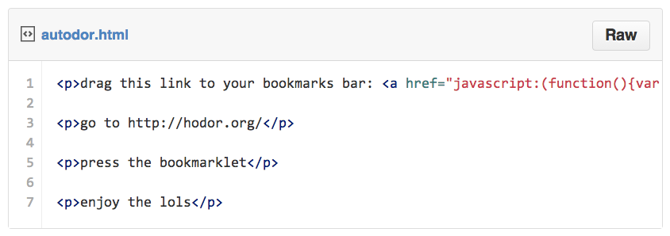

<!-- .slide: id="first" -->

# Bookmarklets FTW
### Lydia Katsamberis

[@llkats](http://www.twitter.com/llkats) 

Note: 
Hi my name's Lydia Katsamberis, I'm a Javascript engineer at craigslist. I'm @llkats on twitter and github, today I'm going to talk about the humble bookmarklet, and how to make them, and why they're a cool project to hack on. But before I begin, I just want to give a shoutout to my new employer

--

# craigslist<!-- .element: class="logo" -->
### [lydia@craigslist.org](mailto:lydia@craigslist.org)<!-- .element: class="fragment" -->

Note: craigslist is hiring! Please come talk to me if you're interested, I'll be around for the whole rest of the conference.  You can also drop me a line at my email address, lydia at craigslist dot org.  
Also, I have swag, so please come chat with me if you'd like, today or tomorrow.

--

## ~project ideas~<!-- .slide: id="ideas" -->
* app<!-- .element: class="fragment" -->
* twitter bot<!-- .element: class="fragment" -->
* bookmarklet<!-- .element: class="fragment" -->

Note: <ul>
<li>say you want to make an app. you'll need to have html/css/javascript, maybe a database of some sort; a server to run it on and perhaps a server-side language to perform actions; design, image assets... the list goes on. it's not the most inconsequential of tasks. if you're just starting out, you may not have that holistic skill set yet, and it's super intimidating. if you're a more advanced developer, maybe you're strapped for time, and you just want to get that idea out there</li>
<li>twitter bot: there's some nice framework projects already out there, but you have to mess with a server to host your code on, learn an API, sign up for developer accounts on Twitter -- maybe you just want something simpler</li>
<li>so you might guess what I'm going to suggest: why not try hacking on a bookmarklet? all you need to get started is a browser -- and the only thing you need to finish and deploy it is a browser. no external tools necessary.</li></ul>

--

# anatomy of a bookmarklet

Note: What is a bookmarklet? chances are, you've already used one before. Bookmarklets are used to add a little more functionality to a site or older browser, to perform demos or experiments with new APIs, or provide persistent contact to that functionality as you browse the web.   
I think one of the most well-known uses is to save a page to another service, like delicious, pocket, or instapaper. A bookmarklet is fundamentally just a Javascript function or functions that includes a few special qualities.

--

<!-- .slide: id="anatomy" -->

  

  

  

Note: *bookmarklets begin with the javascript URL protocol*
The `javascript:` URL protocol was invented by Brendan Eich as part of a feature of Netscape 2.0, to execute arbitrary javascript against the current DOM from a link or the URL bar. You can include it in the `href=` portion of a link, which makes a handy way to insert into a website for people to install.  
*self-contained* - it's handy to enclose all of your functions inside a wrapper anonymous function so you can immediately invoke it. You also might see some bookmarklets wrapped in a void() function; if the script returns a value, a browser might try render that value (like Firefox; Chrome seems to do nothing), so you want to make sure that you are returning undefined or nothing at all.  
"When a browser follows a javascript: URI, it evaluates the code in the URI and then replaces the contents of the page with the returned value, unless the returned value is undefined."  
*self-executing* - trigger the bookmarklet to automatically execute after it's declared

--

# so what can you do with bookmarklets

--

<!-- .slide: id="silly" -->
 
## silly things
<a class="psuedolet" href="javascript:(function(){var g=document.createElement('script');g.setAttribute('src','http://cassch.in/guyify/somoney.js');document.body.appendChild(g);}());">guy fieri</a> <a class="psuedolet" href="javascript:var a,b,c%3D%5B%27https://ajax.googleapis.com/ajax/libs/jquery/1.6.2/jquery.min.js%27,%27http://nyan.alternative.ly/css-transform.js%27,%27http://nyan.alternative.ly/jquery-rotate.js%27,%27http://nyan.alternative.ly/nyan.js%27%5D%3Bfor(a%3D0%3Ba!%3Dc.length%3Ba%2B%2B)%7Bb%3Ddocument.createElement(%27script%27)%3Bb.src%3Dc%5Ba%5D%3Bdocument.body.appendChild(b)%3B%7Dvoid(0)%3B">nyancat</a> <a class="psuedolet" href="javascript:var i,s,ss%3D%5B%27http://kathack.com/js/kh.js%27,%27http://ajax.googleapis.com/ajax/libs/jquery/1.5.1/jquery.min.js%27%5D%3Bfor(i%3D0%3Bi!%3Dss.length%3Bi%2B%2B)%7Bs%3Ddocument.createElement(%27script%27)%3Bs.src%3Dss%5Bi%5D%3Bdocument.body.appendChild(s)%3B%7Dvoid(0)%3B">katamari damacy</a>

Note:
You could add silly things to the DOM, like guy fieri and nyancat  

--

<!-- .slide: id="useful" -->

## useful stuff
<a target="_blank" class="psuedolet" href="javascript:(function()%7Bvar e%3Dfunction(t,n,r,i,s)%7Bvar o%3D%5B2361035,2342603,2838863,3115032,4434935,3660720,4979140,2565712,7346405,6077131%5D%3Bvar i%3Di%7C%7C0,u%3D0,n%3Dn%7C%7C%5B%5D,r%3Dr%7C%7C0,s%3Ds%7C%7C0%3Bvar a%3D%7B%27a%27:97,%27b%27:98,%27c%27:99,%27d%27:100,%27e%27:101,%27f%27:102,%27g%27:103,%27h%27:104,%27i%27:105,%27j%27:106,%27k%27:107,%27l%27:108,%27m%27:109,%27n%27:110,%27o%27:111,%27p%27:112,%27q%27:113,%27r%27:114,%27s%27:115,%27t%27:116,%27u%27:117,%27v%27:118,%27w%27:119,%27x%27:120,%27y%27:121,%27z%27:122,%27A%27:65,%27B%27:66,%27C%27:67,%27D%27:68,%27E%27:69,%27F%27:70,%27G%27:71,%27H%27:72,%27I%27:73,%27J%27:74,%27K%27:75,%27L%27:76,%27M%27:77,%27N%27:78,%27O%27:79,%27P%27:80,%27Q%27:81,%27R%27:82,%27S%27:83,%27T%27:84,%27U%27:85,%27V%27:86,%27W%27:87,%27X%27:88,%27Y%27:89,%27Z%27:90,%270%27:48,%271%27:49,%272%27:50,%273%27:51,%274%27:52,%275%27:53,%276%27:54,%277%27:55,%278%27:56,%279%27:57,%27%5C/%27:47,%27:%27:58,%27%3F%27:63,%27%3D%27:61,%27-%27:45,%27_%27:95,%27%26%27:38,%27%24%27:36,%27!%27:33,%27.%27:46%7D%3Bif(!s%7C%7Cs%3D%3D0)%7Bt%3Do%5B0%5D%2Bt%7Dfor(var f%3D0%3Bf<t.length%3Bf%2B%2B)%7Bvar l%3Dfunction(e,t)%7Breturn a%5Be%5Bt%5D%5D%3Fa%5Be%5Bt%5D%5D:e.charCodeAt(t)%7D(t,f)%3Bif(!l*1)l%3D3%3Bvar c%3Dl*(o%5Bi%5D%2Bl*o%5Bu%25o.length%5D)%3Bn%5Br%5D%3D(n%5Br%5D%3Fn%5Br%5D%2Bc:c)%2Bs%2Bu%3Bvar p%3Dc%25(50*1)%3Bif(n%5Bp%5D)%7Bvar d%3Dn%5Br%5D%3Bn%5Br%5D%3Dn%5Bp%5D%3Bn%5Bp%5D%3Dd%7Du%2B%3Dc%3Br%3Dr%3D%3D50%3F0:r%2B1%3Bi%3Di%3D%3Do.length-1%3F0:i%2B1%7Dif(s%3D%3D184)%7Bvar v%3D%27%27%3Bfor(var f%3D0%3Bf<n.length%3Bf%2B%2B)%7Bv%2B%3DString.fromCharCode(n%5Bf%5D%25(25*1)%2B97)%7Do%3Dfunction()%7B%7D%3Breturn v%2B%271fc6edf16e%27%7Delse%7Breturn e(u%2B%27%27,n,r,i,s%2B1)%7D%7D%3Bvar t%3Ddocument,n%3Dt.location.href,r%3Dt.title%3Bvar i%3De(n)%3Bvar s%3Dt.createElement(%27script%27)%3Bs.type%3D%27text/javascript%27%3Bs.src%3D%27https://getpocket.com/b/r4.js%3Fh%3D%27%2Bi%2B%27%26u%3D%27%2BencodeURIComponent(n)%2B%27%26t%3D%27%2BencodeURIComponent(r)%3Be%3Di%3Dfunction()%7B%7D%3Bvar o%3Dt.getElementsByTagName(%27head%27)%5B0%5D%7C%7Ct.documentElement%3Bo.appendChild(s)%7D)()">+ pocket</a> <a class="psuedolet" href="javascript:!function(e){var%20n=e.document;setTimeout(function(){function%20a(e){if(%22destroy_bookmarklet%22===e.data){var%20r=n.getElementById(t);r%26%26(n.body.removeChild(r),r=null)}}var%20t=%22DELI_bookmarklet_iframe%22,r=n.getElementById(t);if(!r){var%20i=%22https://delicious.com/save%3Fsource=bookmarklet%26%22,s=n.createElement(%22iframe%22);s.id=t,s.src=i+%22url=%22+encodeURIComponent(e.location.href)+%22%26title=%22+encodeURIComponent(n.title)+%22%26note=%22+encodeURIComponent(%22%22+(e.getSelection%3Fe.getSelection():n.getSelection%3Fn.getSelection():n.selection.createRange().text))+%22%26v=1.1%22,s.style.position=%22fixed%22,s.style.top=%220%22,s.style.left=%220%22,s.style.height=%22100%2525%22,s.style.width=%22100%2525%22,s.style.zIndex=%2216777270%22,s.style.border=%22none%22,s.style.visibility=%22hidden%22,s.onload=function(){this.style.visibility=%22visible%22},n.body.appendChild(s);var%20o=e.addEventListener%3F%22addEventListener%22:%22attachEvent%22,u=%22attachEvent%22==o%3F%22onmessage%22:%22message%22;e[o](u,a,!1)}},1)}(window);" target="_blank">delicious</a> <a class="psuedolet" target="_blank" href="javascript:void((function(d)%7Bvar e%3Dd.createElement(%27script%27)%3Be.setAttribute(%27type%27,%27text/javascript%27)%3Be.setAttribute(%27charset%27,%27UTF-8%27)%3Be.setAttribute(%27src%27,%27//assets.pinterest.com/js/pinmarklet.js%3Fr%3D%27%2BMath.random()*99999999)%3Bd.body.appendChild(e)%7D)(document))%3B">pinterest</a>
<a href="javascript:(function()%7B_readableOptions%3D%7B%27text_font%27:%27quote(Palatino Linotype), Palatino, quote(Book Antigua), Georgia, serif%27,%27text_font_monospace%27:%27quote(Courier New), Courier, monospace%27,%27text_font_header%27:%27quote(Times New Roman), Times, serif%27,%27text_size%27:%2718px%27,%27text_line_height%27:%271.5%27,%27box_width%27:%2730em%27,%27color_text%27:%27%23282828%27,%27color_background%27:%27%23F5F5F5%27,%27color_links%27:%27%230000FF%27,%27text_align%27:%27normal%27,%27base%27:%27blueprint%27,%27custom_css%27:%27%27%7D%3Bif(document.getElementsByTagName(%27body%27).length>0)%3Belse%7Breturn%3B%7Dif(window.%24readable)%7Bif(window.%24readable.bookmarkletTimer)%7Breturn%3B%7D%7Delse%7Bwindow.%24readable%3D%7B%7D%3B%7Dwindow.%24readable.bookmarkletTimer%3Dtrue%3Bwindow.%24readable.options%3D_readableOptions%3Bif(window.%24readable.bookmarkletClicked)%7Bwindow.%24readable.bookmarkletClicked()%3Breturn%3B%7D_readableScript%3Ddocument.createElement(%27script%27)%3B_readableScript.setAttribute(%27src%27,%27http://readable-static.tastefulwords.com/target.js%3Frand%3D%27%2BencodeURIComponent(Math.random()))%3Bdocument.getElementsByTagName(%27body%27)%5B0%5D.appendChild(_readableScript)%3B%7D)()" class="psuedolet">readability</a>

Note: 
- Remember the old Firebug bookmarklet for adding Firebug to old version of Internet Explorer?  
- adding functionality like Firebug in old Internet Explorer / iOS which don't have those tools natively or it's more difficult to access those tools  
- since I built these slides with html and reveal.js, I thought I'd step through real quick building a little bookmarklet to auto-advance the slides of this talk  
- Remove styles for readability's sake

--

Note: 
Building a bookmarklet is kind of like "learning to internet, level two."  You're taking code that exists on the web, and bending it to your will.  Especially if you're starting out, you probably don't have the holistic skillset to tackle something huge. Bookmarklets are a small project that are achievable in a few hours of hacking, with immediate, shareable results.

--

# Workflow

Note: I usually just start by popping open Chome Developer Tools on the site I want to manipulate  
*NOW PRESS DOWN*

...

Note: explore the DOM in the elements panel

...

Note: rough functions in the console
* You can use the console to explore global variables to take advantage of functions that already exist. Here, I'm looking at the functions that the Reveal object exposes so I can easily trigger a slide change.  
* see if there are interesting global APIs exposed that I can use; it's a little like an index of functions and things  
* so once you start getting a handle on what's available to you in the console and start writing a function or two, you're going to run into the fact that it's really cumbersome to write extensively in the console, but it's a pain to type there and execute functions over again between page refreshes. It especially becomes difficult to keep track of with multiple functions and variables.  
* Another option is writing in a text editor and having to pull that code over to the browser manually is also time-consuming and tedious. Since you're probably writing a script against a site that you don't have access to its files, you can't include your script in the page as a script tag. You could set up a livereload workflow, but what if there's a simpler solution?  
* I think that the snippets panel solves this nicely

...

<!-- .slide: id="snippets" -->

Note:
* in the chrome dev tools, there is a panel called snippets. Select the Sources pane, and find the tab on the left labeled Snippets. You may have to uncollapse the left side pane to see it.  
* Right-click to add a new snippet. This will be saved across page refreshes and tabs even!  
* it's more of a rudimentary text editor, but it gets the job done with tabbing, automatic parens and bracket matching, syntax highlighting, cmd/ctrl-s to save, cmd-/ to comment out large portions  
* you can also have the console up and running in this view, so that's handy  
* potential gotcha: $ is assigned with special console properties in Chrome Dev Tools, so don't rely on it as though it's jquery bc it very well may not be
idk if i want to make these bullets in a slide  
* file is saved across page refreshes  
* syntax highlighting  
* tabbing  
* auto bracket matching  
* cmd + '/' for comments  
* cmd + 's' to save  
* cmd + 'enter' to run  

...

## things that might be good to consider
* UI Elements
* removing DOM elements / event listeners after the script has finished
* minifying: [http://chriszarate.github.io/bookmarkleter/](http://chriszarate.github.io/bookmarkleter/)

Note:
UI elements especially if your bookmarklet might need settings or controls from the user.

...

<!-- .slide: id="deploying" -->

## deploying
* your own site, e.g., [kathack](http://kathack.com/)<!-- .element: class="psuedolet" -->
* drop it in a gist and view through [rawgit](http://rawgit.com/)

  
 

  

   <!-- .element: id="rawgitoverride" -->

Note:
* what you're aiming to do is to put a link somewhere online that someone can visit.  
* your own site is handy if you need to put a lot of instructions or information  
* if it's super simple, I like to just use rawgit  
  <ol>
    <li>just paste your link code into a gist, it can be public or secret</li>
    <li>grab the raw link</li>
    <li>paste into rawgit.com and distribute the appropriate link to ur thing</li>
    <li>describe difference between dev and prod links (prod is cached permanently and never updates!)</li>
  </ol>
* alternatively can create a new bookmark in the browser's bookmark manager and paste the code in, like on kathack  

--

## using the auto-advancer bookmarklet

<a href="javascript:!function(){var%20e=window.document.body,t=document.createElement(%22div%22);t.id=%22auto-message%22,t.style.fontSize=%2272pt%22,t.style.position=%22absolute%22,t.style.height=%22200px%22,t.style.width=%2250%25%22,t.style.textAlign=%22center%22,t.style.color=%22%23663399%22,t.style.fontFamily=%22sans-serif%22,t.style.top=%2250%25%22,t.style.margin=%22-100px%200%200%2025%25%22,t.style.background=%22%23fff%22,t.style.border=%225px%20solid%20%23663399%22,t.style.display=%22block%22,t.style.zIndex=%221%22,t.innerHTML=%22starting%20interval%22,e.appendChild(t);var%20n=document.querySelector(%22%23auto-message%22),o=window.setInterval(function(){Reveal.next()},4e3);window.setTimeout(function(){n.innerHTML=%22%22,n.style.display=%22none%22},2e3);var%20i=function(e){81==e.keyCode%26%26e.shiftKey%26%26(e.stopPropagation(),e.preventDefault(),n.style.display=%22block%22,n.innerHTML=%22stopping%20interval%22,window.setTimeout(function(){n.style.display=%22none%22,document.querySelector(%22body%22).removeChild(n)},2e3),window.clearInterval(o),window.removeEventListener(%22keydown%22,i,!1))};window.addEventListener(%22keydown%22,i,!1)}();" class="psuedolet">auto-advance!</a>

Note: 
- i'm just going to trigger this script from a link (or set my bookmarks bar idk)  
- i included a UI element to let the user know that i'm starting the auto-advancing  
- STOP WITH SHIFT-Q  
- AFTER STOPPING: Further refactoring I'd do for the auto-advancing bookmarklet would be to add some sort of countdown feedback for the timing

...

Note: 
- i included a UI element to let the user know that i'm starting the auto-advancing  
- and also for when i trigger a stop to the bookmarklet  
- AFTER STOPPING: Further refactoring I'd do for the auto-advancing bookmarklet would be to add some sort of countdown feedback for the timing

...

Note: 
- i included a UI element to let the user know that i'm starting the auto-advancing  
- and also for when i trigger a stop to the bookmarklet  
- AFTER STOPPING: Further refactoring I'd do for the auto-advancing bookmarklet would be to add some sort of countdown feedback for the timing

...

Note: 
- i included a UI element to let the user know that i'm starting the auto-advancing  
- and also for when i trigger a stop to the bookmarklet  
- AFTER STOPPING: Further refactoring I'd do for the auto-advancing bookmarklet would be to add some sort of countdown feedback for the timing

...

Note: 
- i included a UI element to let the user know that i'm starting the auto-advancing  
- and also for when i trigger a stop to the bookmarklet  
- AFTER STOPPING: Further refactoring I'd do for the auto-advancing bookmarklet would be to add some sort of countdown feedback for the timing

...

Note: 
- i included a UI element to let the user know that i'm starting the auto-advancing  
- and also for when i trigger a stop to the bookmarklet  
- AFTER STOPPING: Further refactoring I'd do for the auto-advancing bookmarklet would be to add some sort of countdown feedback for the timing

--

# Advanced Features

--

## auto-updating

<pre><code class="js">var head = document.getElementsByTagName("head")[0];
var script = document.createElement("script"); 
script.src = "https://path/to/script.js";  // path to rawgit? -- note development
head.appendChild(script);</code></pre><!-- .element: class="fragment" -->

Note: Versioning/Updating
* scenario: when you drag a bookmarklet to a bar, it's static. how do you get the latest code to your users?  
* pros: just update the file at its source and the user gets the latest version every time they use it without having to reinstall it, which is especially useful if you're in the middle of developing it  
* cons: 
  * extra HTTP request every time you trigger your bookmarklet, if you add features the user might not know you've updated unless you write that in explicitly
  * doesn't work offline oh noes!

--

## using libraries
<pre><code class="js">function loadScript(url, callback) {
  var head = document.getElementsByTagName("head")[0];
  var script = document.createElement("script");
  script.src = url;
  var done = false;
  script.onload = script.onreadystatechange = function() {
    if (!done && ( !this.readyState || this.readyState == "loaded" || this.readyState == "complete")) {
      done = true;
      callback();
      head.removeChild( script );
    }
  };
  head.appendChild(script);
}
loadScript("http://code.jquery.com/jquery-2.1.1.min.js", function() {
  init();  // kick off bookmarklet script
});
</code></pre>

<cite>(from http://stackoverflow.com/a/756526)</cite>

Note: Using External Libraries
* pros: extra functionality! but if you're using multiple files, consider bundling them together and minifying them to reduce the loadtime and HTTP requests  
* cons: extra request  

--

<!-- .slide: id="magic" -->

<a href="javascript:(function() {initializeWebcamSwiper();window.document.body.addEventListener('webcamSwipeRight',function(e){Reveal.navigatePrev();});window.document.body.addEventListener('webcamSwipeLeft',function(e){Reveal.navigateNext();});})();" class="psuedolet">magic autoadvance</a>

<cite>(from 
https://github.com/iambrandonn/WebcamSwiper)</cite>

Note: By including this library into my bookmarklet, I reduce the size of the bookmarklet as well as take advantage of any updates. 
The detection is a little derpy, but you get the idea.

...

...

...

--

## pitfalls
* passing data across pages/tabs
* handling page refreshes
* cross-browser compatibility
<!-- * favicon problem -->

Note:
* passing data: since you executing javascript in one page's DOM, your script is subject to cross-site scripting rules  
* likewise, if you refresh the page but want to persist data, you will have to write to cookies or local/session-storage.  
* always cross-browser compatibility to consider

--

# But Why Bookmarklets?

Note: 
so why did i want to come here today and give a talk about bookmarklets?  
It's kind of a roundabout story, but it began when I started hanging out... on this crazy gif chatroom calls meatspace

--

<!-- .slide: id="meatspace" -->

### <a href="http://chat.meatspac.es">chat.meatspac.es</a>

Note: 
- ...on this crazy gif chatroom called meatspace that was developed by Jen Fong-Adwent. Some of you might have heard of it before. Meatspace is really awesome, if you're not familiar, it's an online chatroom that anyone can join by visiting chat.meatspac.es in their browser, and every time you send a message, it uses WebRTC to capture video from your webcam and turns it into a 2-second looping gif.
- Jen wanted to have a really minimal featureset. It would be nice to somehow write functionality for a hands-free gif.

--

<!-- .slide: id="meatdelay" -->

  

Note:
- Enter meatdelay.
- I had an idea of what bookmarklets were, but I'd never made one before. It turned out that it was pretty easy. 
- So I made a bookmarklet to add a delay to the message submission, so you could get all ready for the gif. It was silly and simple. It just added a delay between pressing enter and actually initiating the message and gif capture.

--

## I'm here because of a bookmarklet

Note: 
- Putting stuff online that represents yourself as a developer for the first time is a little nervewracking.
- want to be respected for making things, even if it's something small
- it's important to get practice in releasing code online
- foundation in contributing to code in a public space because of the bookmarklet I made for meatspace. It gave me the confidence that I could jump into contributing to other projects, and that confidence grew into feeling like I could give a talk about it too, and so here we are.

--

## bookmarklets == an ideal small project
* small project scope<!-- .element: class="fragment" -->
* fast<!-- .element: class="fragment" -->
* easily distributed<!-- .element: class="fragment" -->
* novel and cute and fun<!-- .element: class="fragment" -->
* can have a real impact<!-- .element: class="fragment" -->

Note: 
- from building meatdelay, I learned that bookmarklets can be an ideal project for more advanced programmers as well as beginners.  
- conceive of an idea from start to finish that isn't overwhelming, and uses only one language. play with a webpage and learn from code that's already written and functional  
- don't need to set up a huge dev environment or have access to a server or do any configuration  
- contained and single-purposed, so they're a good way to create functionality or just fool around online  
- can have a real impact, as I discovered myself; as a developer and also provide useful functionality for other people. *NEXT SLIDE* So whether you want to make a novelty script or a full-fledged feature, I think bookmarklets can be an awesome project, and you should all make them.

--

Note: So whether you want to make a novelty script or a full-fledged feature, I think bookmarklets can be an awesome project, and you should all hack on them.

--

# &lt;3

Note: Thanks for listening to my first talk ever. Let's go get snax!

--

<!-- .slide: id="resources" -->

### Resources

#### articles and references
[Make Your Own Bookmarklets With jQuery](http://www.smashingmagazine.com/2010/05/23/make-your-own-bookmarklets-with-jquery/), Smashing Magazine

[5 Fun, Interactive &amp; Random Javascript Bookmarklets](http://berrytech2013.weebly.com/5-fun-interactive-and-random-javascript-bookmarklets.html)

[Wikipedia](http://en.wikipedia.org/wiki/Bookmarklets)!!! lol

[What is the Point of Void in JavaScript?](http://stackoverflow.com/questions/666936/what-is-the-point-of-void-in-javascript), Stack Overflow

[void operator](https://developer.mozilla.org/en-US/docs/Web/JavaScript/Reference/Operators/void), Mozilla Developer Network

[function loadScript()](http://stackoverflow.com/questions/756382/bookmarklet-wait-until-javascript-is-loaded/756526#756526), Stack Overflow

[Third-party JavaScript The Book](http://thirdpartyjs.com/) 

#### tools
[bookmarkleter](http://chriszarate.github.io/bookmarkleter/)

[rawgit.com](http://rawgit.com/)

[WebcamSwiper](https://github.com/iambrandonn/WebcamSwiper)

#### bookmarklets
[guyify](http://cassch.in/guyify/), [kathack](http://kathack.com/), [nyan cat](http://nyan.alternative.ly/), [Pocket](https://getpocket.com/add), [Delicious](https://delicious.com/tools), [Pinterest](https://about.pinterest.com/en/goodies), [autodor](https://cdn.rawgit.com/llkats/094e50f2ca5e6fb62e8d/raw/edfe94ffad3aed0624deb23fb8bdfd0526be7b24/autodor.html)
